# Reaction Time Test System

Sistem pengukur waktu reaksi profesional yang terdiri dari multiple ESP32, Arduino Uno dengan TFT Shield, dan aplikasi web untuk menguji respons pengguna terhadap berbagai stimulus (visual, auditori, dan kompleks).

## ✨ Fitur Utama

- ✅ **Tiga Mode Pengujian**: Sound, LED, dan Visual
- ✅ **Pengukuran Waktu Reaksi Akurat** menggunakan millis()
- ✅ **Antarmuka Web Responsif** dengan tab navigation
- ✅ **Koneksi Real-time** menggunakan WebSocket
- ✅ **Data Management** dengan penyimpanan session dan export CSV
- ✅ **Branding "Ergoquipt"** pada layar TFT saat idle

## 🏗️ Arsitektur Sistem

### Perangkat Hardware:
1. **ESP32 Server** (Master) - IP: 192.168.4.1
2. **ESP32 Client 1** - IP: 192.168.4.10 (5 push button)
3. **ESP32 Client 2** - IP: 192.168.4.11 (1 push button visual)
4. **Arduino Uno dengan TFT Shield** - Komunikasi serial dengan ESP32 Server

## 🔄 Flowchart Sistem Lengkap

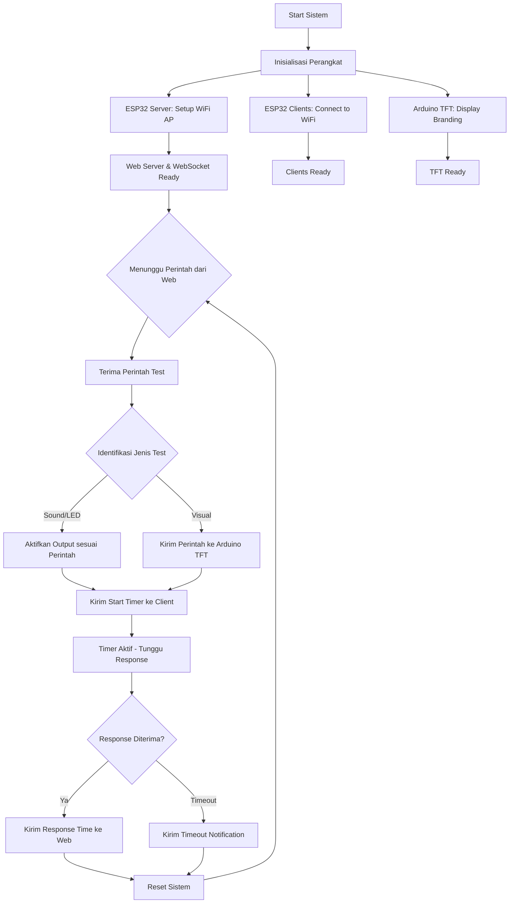

## 🌐 Topologi Jaringan

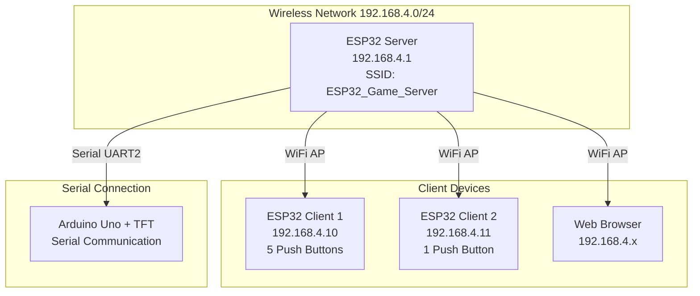

## 📊 Diagram Alur Data

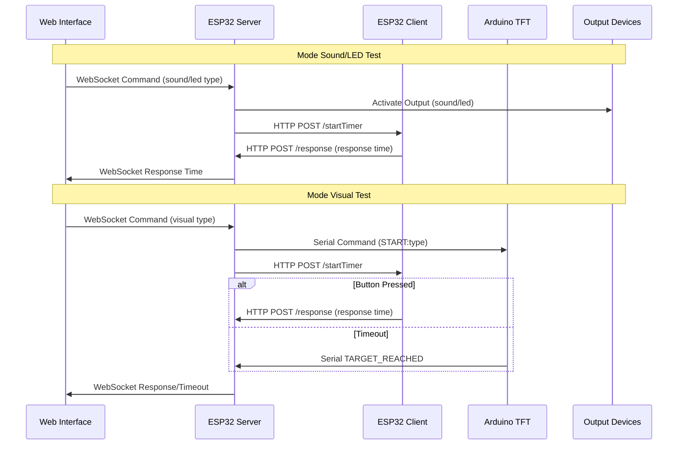

## 📋 Persyaratan Hardware

- 3x ESP32 Development Board
- 1x Arduino Uno + TFT Shield ILI9341
- 6x Push Buttons (5 untuk Client 1, 1 untuk Client 2)
- 3x LED (Merah, Kuning, Biru)
- 1x DFPlayer Mini dengan Speaker
- Kabel jumper dan breadboard

## 🔌 Koneksi Hardware

### ESP32 Server
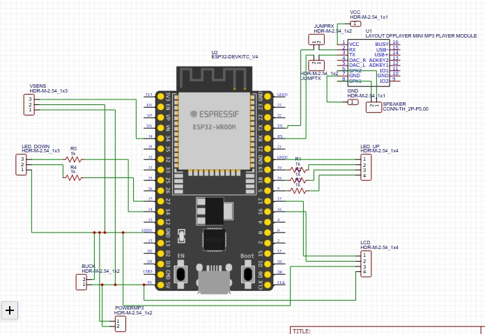
Pin configuration untuk ESP32 Server:
- LED Merah: GPIO 19
- LED Kuning: GPIO 18  
- LED Biru: GPIO 5
- DFPlayer Mini: UART0 (GPIO 3 RX, GPIO 1 TX)
- Arduino Serial: UART2 (GPIO 16 RX, GPIO 17 TX)

### ESP32 Client 1
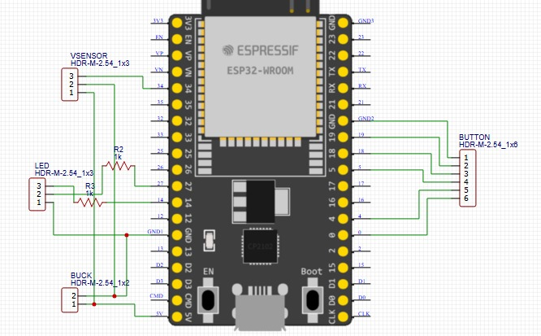
Pin configuration untuk ESP32 Client 1:
- Button Merah: GPIO 5
- Button Kuning: GPIO 18
- Button Biru: GPIO 19
- Button Sirine: GPIO 0
- Button Ambulance: GPIO 4

### ESP32 Client 2
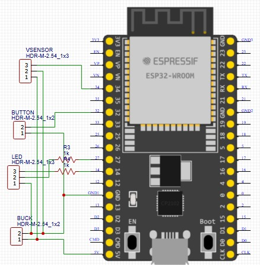
Pin configuration untuk ESP32 Client 2:
- Visual Button: GPIO 32

## 📱 Preview Aplikasi Web

Berikut adalah tampilan antarmuka web yang digunakan untuk mengontrol sistem:

### Tampilan Splash Screen
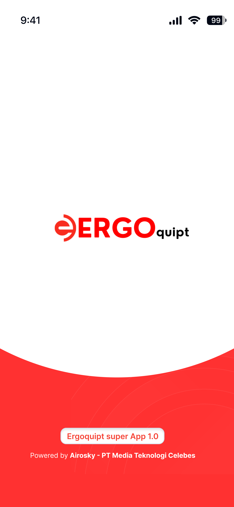
*Branding*

### LED Mode
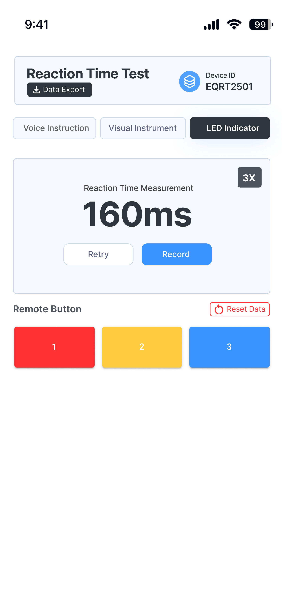
*Mode LED - untuk menguji respons terhadap stimulus visual LED*

### Sound Mode
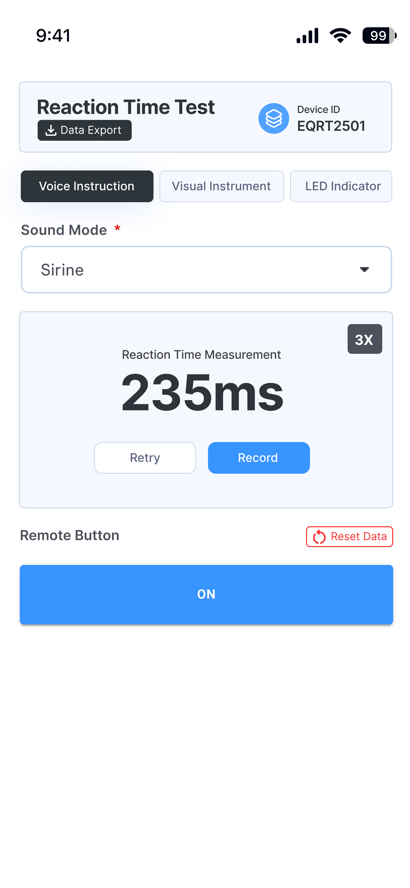
*Mode Sound - untuk menguji respons terhadap stimulus sound*

### Visual Mode
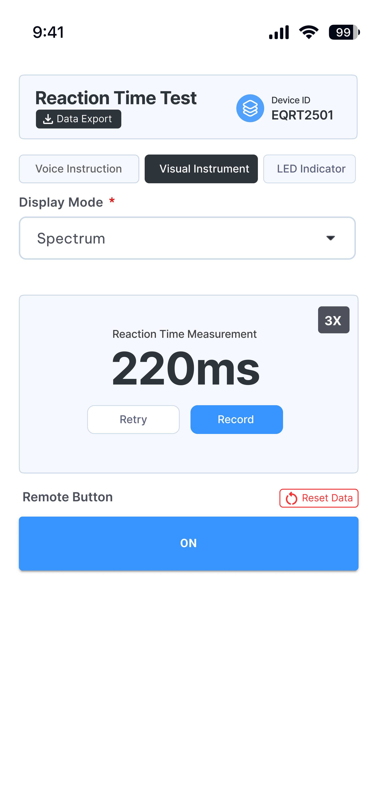
*Mode Visual - untuk menguji respons terhadap stimulus visual complex*

### Data Export
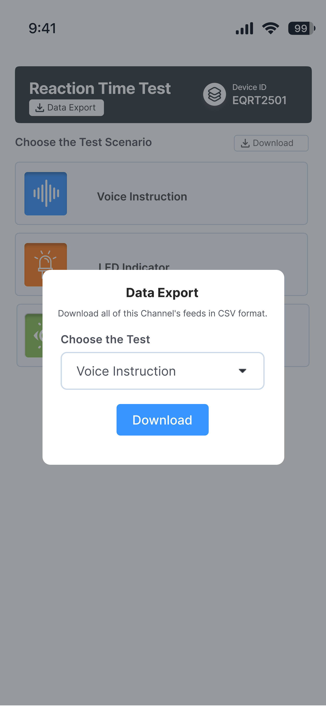
*Fitur export data untuk analisis hasil pengujian*

## 🚀 Instalasi dan Penggunaan

### 1. Klon Repository
```bash
git clone https://github.com/username/reaction-time-test-system.git
cd reaction-time-test-system
```

### 2. Upload Firmware ke Perangkat

#### ESP32 Server
```bash
cd firmware/esp32-server
pio run -t upload
```

#### ESP32 Client 1
```bash
cd firmware/esp32-client1
pio run -t upload
```

#### ESP32 Client 2
```bash
cd firmware/esp32-client2
pio run -t upload
```

#### Arduino TFT
```bash
cd arduino-tft
pio run -t upload
```

### 3. Hubungkan Hardware
Lihat diagram wiring di [docs/wiring-diagram.md](docs/wiring-diagram.md)

### 4. Jalankan Sistem
1. Hubungkan smartphone/PC ke hotspot "ESP32_Game_Server" (password: 12345678)
2. Buka browser dan akses http://192.168.4.1
3. Sistem siap digunakan

## 📁 Struktur Kode

```
firmware/
├── esp32-server/      # Master controller (AP + Web Server + WebSocket)
├── esp32-client1/     # Client dengan 5 button (LED & Sound)
└── esp32-client2/     # Client dengan 1 button (Visual Mode)

arduino-tft/           # Kontrol tampilan TFT dengan gauge/spectrum
web-interface/         # Aplikasi web untuk kontrol dan monitoring
docs/                  # Dokumentasi dan diagram
```

## 🌐 Konfigurasi Jaringan

| Perangkat       | Alamat IP     | Peran                     |
|-----------------|---------------|---------------------------|
| ESP32 Server    | 192.168.4.1   | AP + Web Server + WebSocket |
| ESP32 Client 1  | 192.168.4.10  | Button controller (5 button) |
| ESP32 Client 2  | 192.168.4.11  | Visual button controller |

## 🔌 Pinout

### ESP32 Server
- LED Merah: GPIO 19
- LED Kuning: GPIO 18  
- LED Biru: GPIO 5
- DFPlayer Mini: UART0 (GPIO 3 RX, GPIO 1 TX)
- Arduino Serial: UART2 (GPIO 16 RX, GPIO 17 TX)

### ESP32 Client 1
- Button Merah: GPIO 5
- Button Kuning: GPIO 18
- Button Biru: GPIO 19
- Button Sirine: GPIO 0
- Button Ambulance: GPIO 4

### ESP32 Client 2
- Visual Button: GPIO 32

## 🔧 Pengembangan

### Menambahkan Fitur Baru
1. Fork repository ini
2. Buat branch untuk fitur baru (`git checkout -b feature/amazing-feature`)
3. Commit perubahan Anda (`git commit -m 'Add amazing feature'`)
4. Push ke branch (`git push origin feature/amazing-feature`)
5. Buat Pull Request

## 📝 Lisensi

Distributed under the MIT License. See `LICENSE` for more information.

## 👥 Tim Pengembang

- [Fariz] - [Fullstack_Engineer] - [frzxx210@gmail.com]

## ❓ Dukungan

Jika Anda memiliki pertanyaan atau masalah, silakan buat issue di repository ini atau hubungi tim pengembang.

---

<div align="center">
Dikembangkan dengan ❤️ oleh Tim Ergoquipt
</div>

## 📊 Contoh Data Output

Sistem ini menghasilkan data reaksi waktu yang dapat diekspor dalam format CSV:

| Attempt | Response Time | Test Type | Timestamp |
|---------|---------------|-----------|-----------|
| 1 | 245ms | Sound: Siren | 2023-12-01 10:30:45 |
| 2 | 189ms | LED: Red | 2023-12-01 10:32:15 |
| 3 | 302ms | Visual: Gauge | 2023-12-01 10:35:22 |

Untuk informasi lebih lanjut, silakan merujuk ke dokumentasi lengkap di folder [docs/](docs/).